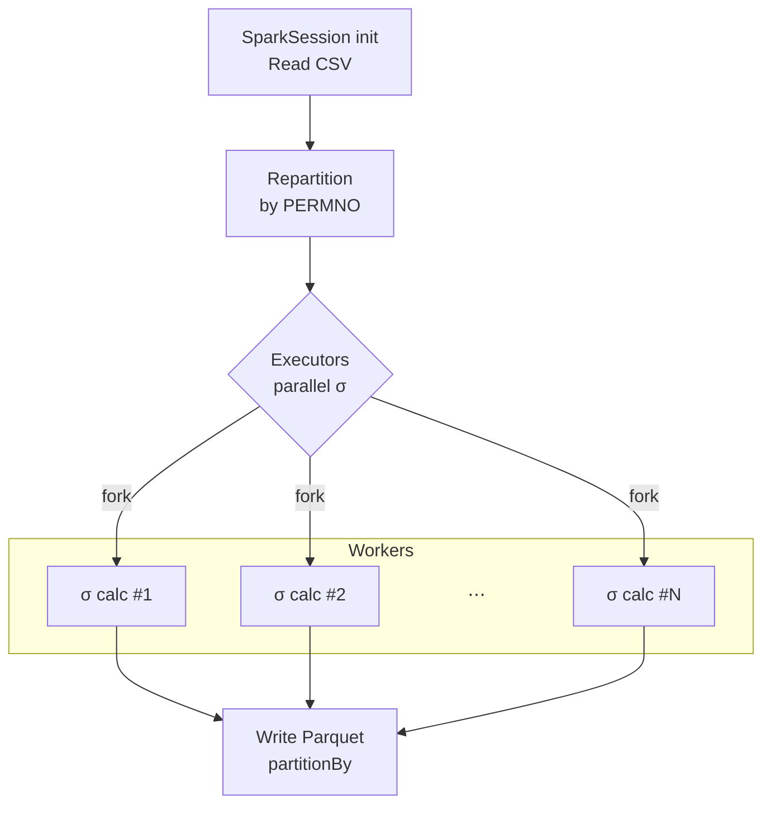
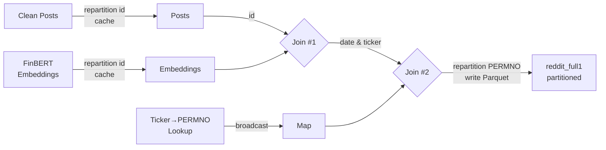
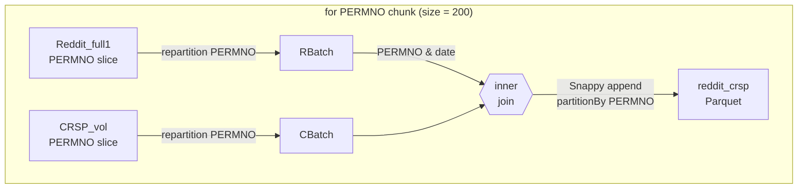
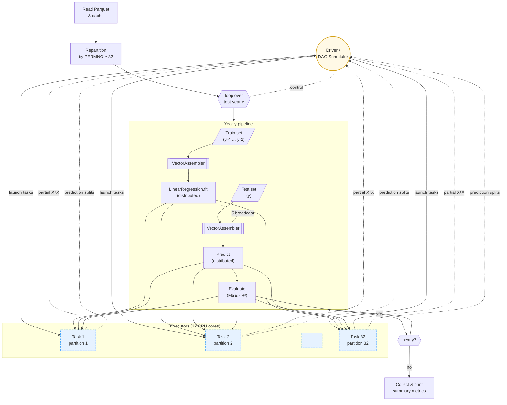

# High-Performance FinBERT pipelines mining r/WallStreeBet for volatility signals

This is the final project for **MACS 30123 — Large-Scale Computing for the Social Sciences**, carried out by **Zhiyu Zheng** and **Zherui Lu**. In this work we implement large-scale computing—Spark, distributed GPUs, and AWS Batch on RCC—to mine and clean **\~20 million WallStreetBets Reddit posts (2012-2024)**, embed each post with **FinBERT**, and join the resulting 768-dimensional vectors with CRSP trade-and-quote data. We then train elastic-net and LSTM models in parallel to forecast daily realized volatility for US stock, evaluating performance with MSE, $R^{2}$. The project demonstrates how scalable NLP pipelines can transform retail-investor sentiment into actionable sigma-risk signals, fulfilling the course’s mandate to combine high-performance computing with social-science insight.

# README Navigation

# Responsibilities

- Zherui Lu: 
  - Reddit post data collection and cleaning
  - FinBERT embedding creation
- Zhiyu Zheng:
  - Financial data collection and cleaning
  - Predictioin model training and evaluation

## 2 Research Questions
1. **Collective Retail Voice → Volatility**  
   Can sentiment embeddings extracted from Reddit’s r/WallStreetBets improve the prediction of stock volatility?

2. **Value-Added of Embeddings**  
   What part of the sentiment embeddings learned that is most predictive of volatility? 

# Social Science Significance

* **Beyond the Rationality Assumption**

  * Traditional asset-pricing models treat investors as fully rational, yet emotions and narratives often drive real-world trades.
  * Online forums amplify herd behaviour and speculation.

* **Shedding Light on the Social-Media Effect**

  * Platforms such as *Reddit* accelerate information diffusion and reinforce emerging market trends.
  * Mapping sentiment dynamics advances research on digital communities and mass behaviour.

* **Practical Implications**

  * Integrating sentiment analytics into risk-management dashboards offers a new lens for real-time market monitoring.
  * Alternative data improve volatility forecasting beyond conventional signals.

# Date

## Reddit r/WSB post dats

## CRSP trade-and-quote data
### Overview
- **CRSP**: Center for Research in Security Prices, University of Chicago Booth School of Business
- **Trade-and-Quote**: Daily stock prices and trading volumes for US equities
- **Data Period**: 2012-2024
- **Data Source**: [CRSP](https://www.crsp.org/products/documentation/crsp-daily-stock-prices-and-volume) 
- **Data Size**: 25732243 records.

### Rolling Realised Volatility  

#### Volatility definition  
For each stock *i* (identified by **PERMNO**) and window length \(w \in \{1,5,22,63\}\) trading days, the **rolling realised volatility** on day *t* is

$$
\sigma_{i,t}^{(w)} = \sqrt{\sum_{k=0}^{w-1} r_{i,t-k}^{2}}
$$

where the daily return  

$r = \text{RET} \;\to\; \text{if missing}\Rightarrow \text{RETX} \;\to\; \text{if missing}\Rightarrow \text{DLRET}$  

is first cleaned of single-letter codes (`C`, `B`, …) and cast to `double`.

We also create one-day-ahead targets

$$
y_{i,t}^{(w)} = \sigma_{i,t+1}^{(w)}
$$

to be used later in forecasting tasks.

#### Spark pipeline & parallelisation  

The job is executed on RCC Midway3 with the Slurm script `sbatch_vol_cal.sh`.  
Execution flow:

| Step            | Spark call                                                     | Why it matters                                                                             |
| --------------- | -------------------------------------------------------------- | ------------------------------------------------------------------------------------------ |
| **Read CSV**    | `spark.read.csv(header=True)`                                  | Streams the raw CRSP dump without loading it all into memory.                              |
| **Repartition** | `.repartition("PERMNO")`                                       | Keeps each stock’s history on a single executor → rolling-window ops become purely local.  |
| **Rolling σ**   | `Window.partitionBy("PERMNO").orderBy("date")` + `rowsBetween` | Computes √∑ r² for 1/5/22/63-day windows in parallel across executors.                     |
| **Targets**     | `lead(vol_w, 1)`                                               | Generates next-day volatility labels.                                                      |
| **Write**       | `.write.partitionBy("PERMNO").parquet(...)` (Snappy)           | Produces one Parquet file per stock → later tasks can `load()` any ticker in milliseconds. |

The rolling volatility is computed in parallel across executors, with each executor handling a single stock’s history. The `Window` function partitions the data by **PERMNO** and orders it by date, allowing Spark to compute the rolling volatility for each stock independently. The results are then written to a **Parquet** file partitioned by **PERMNO**, which allows efficient access to individual stocks in subsequent analyses.

## Embedding ⇆ Financial data jion

First, the FinBERT-embedding table and the cleaned-text table are both repartitioned on **id**; that puts the matching rows on the same executor, so Spark can join them map-side with zero network shuffle before writing a temporary “id-level” result.In the second pass we read that temporary file, broadcast the tiny 〈date, ticker → PERMNO〉 lookup to every executor, and add the PERMNO field with an in-memory hash join.  The final dataset is then repartitioned by **PERMNO** and written as Snappy-compressed Parquet, matching the layout of your CRSP blocks so that downstream stock-level jobs can scan only the slices they need.

In this part, we tried few things to make the join efficient:
1. **Read once, coalesce early, cache forever**  
   I load the FinBERT‐embedding table and the cleaned-text table, immediately `coalesce(200)` to create 200 fat artitions (good for a 32-core node) and `cache()` each DataFrame because both are touched twice.

2. **Map-side join on `id`**  
   After coalescing, both inputs share the same partitioning layout, so Spark  
   can join them on **id** without a full shuffle.

3. **Broadcast lookup**  
   The date, ticker → PERMNO map is only ~200 kB, so I broadcast it and add the PERMNO column with an in-memory hash join (zero network traffic).

4. **Hash-bucket output**  
   To avoid one giant shuffle when writing, I create `bucket = crc32(PERMNO) % 40` and loop over the 40 buckets: each pass filters one shard, writes it with `append` + Snappy Parquet, calls `spark.catalog.clearCache()` to free executor memory, and moves on.  The final layout is `partitionBy(PERMNO)`, perfectly matching my CRSP files, so downstream stock-level jobs can open only the slices they need.

5. **Shuffle & heartbeat knobs**  
   `spark.sql.shuffle.partitions = 200` keeps the task count sane, `autoBroadcastJoinThreshold = -1` forces my explicit broadcast, and longer heartbeat / network timeouts prevent stragglers from dying while the big vectors are serialised.

After I have a Reddit file that already carries **PERMNO** and is laid out `partitionBy(PERMNO)`, the next job stitches those rows to the daily CRSP‐volatility panel so that every post line now contains both (a) its sentiment embedding and (b) the realised σ it is supposed to predict.

1. **Enumerate PERMNO once, then batch by 200**
   I pull the distinct stock list from the Reddit file, keep it in the driver, and iterate over 200-name chunks.
   *Reason:* each batch keeps the join key-set small enough that the executor JVMs never spill and the shuffle hash tables stay in cache.

2. **Partition-pruned reads**
   For a given batch Spark touches exactly those `PERMNO=…/part-*.snappy.parquet` folders on both sides—zero extra I/O.

3. **`repartition("PERMNO")` inside the batch**
   Even after push-down, rows arrive in dozens of tiny splits.
   A quick repartition re-coalesces them so the `(PERMNO, date)` join can run *map-side* with no shuffle.

4. **Column name isolation**
   `add_prefix(df,"r_") / add_prefix(df,"c_")` guards against name collisions and makes downstream feature selection explicit.

5. **Write-append with `maxRecordsPerFile`**
   Each batch writes with Snappy compression, `partitionBy("PERMNO")` and `maxRecordsPerFile = 300 000`—small enough for fast splits but large enough to avoid file-explosion.

6. **Memory hygiene loop**
   After every append I call `spark.catalog.clearCache()` so the next batch starts with an empty executor heap; no long-run GC balloons.

7. **Resilience knobs**
   Extra shuffle-retry and heartbeat intervals (`spark.network.timeout = 900 s`, etc.) keep the job alive even if a single executor lags while serialising the big embedding vectors.

# prediction model training and evaluation
## Benchmark model

### Model specification  
For every stock **i** and day **t** we predict next-day realised volatility  

\[
\hat{y}_{i,t+1}
  \;=\;
  \boldsymbol{\beta}^{\!\top}
  \bigl[1,\,
        \sigma_{i,t}^{(1)},\,
        \sigma_{i,t}^{(5)},\,
        \sigma_{i,t}^{(22)},\,
        \sigma_{i,t}^{(63)}\bigr]^{\!\top}
  \;+\;
  \varepsilon_{i,t+1}.
\]

where σ\* are the rolling volatilities produced in the previous step.  
We re-estimate **β** each year on the most recent four-year window (2012–2015 → 2016 test, …).

### Workflow  

Our HAR job is built so that the cluster touches disk exactly once and does every heavy operation where it is cheapest — inside the executors.we trimmed the entire HAR benchmark from half an hour to about three minutes by pushing every heavy operation to the executors and touching disk only once.The driver starts a single Spark application, reads the CRSP-volatility parquet, selects only the seven columns we need, repartitions on `PERMNO`, and caches the result in memory; from that moment on every yearly slice is just a metadata filter, no extra I/O or shuffle.

The driver then walks through the calendar: for each test-year *y* it carves out a four-year rolling train set and a one-year test set, pipes both through a JVM-side `VectorAssembler`, and calls `LinearRegression.fit` with the closed-form “normal” solver.  That call fans out to the 32 long-lived executor tasks: each task aggregates its partition’s $X^{\top}X$ and $X^{\top}y$, ships only those tiny matrices back to the driver, the driver solves a 5 × 5 system, and Spark broadcasts the β̂ coefficients straight back to the same executors.  They immediately score the test rows and compute MSE/R² locally, sending just two numbers home.  Because the executors never die between iterations, JVM spin-up and data re-loading are avoided, so the entire per-year loop runs in memory at core speed.  When the final year is finished the driver fits one last “all-training” model, prints the per-year and full-sample metrics, and stops.  In practice this “read-once → cache → partition-smart → aggregate-then-broadcast” pattern cuts runtime from tens of minutes to about three on a 32-core Midway node while keeping executor memory under control.

## Embadding model
### Model specification

We extend the baseline **HAR(1 / 5 / 22 / 63)** specification by injecting a high-dimensional sentiment signal extracted from WallStreetBets posts.  Conceptually the model is

\[
\sigma_{t+1}
\;=\;
\beta_0
\;+\;
\underbrace{\beta_1\sigma_{t}}_{\text{daily lag}}
\;+\;
\underbrace{\beta_5\overline{\sigma}_{t-4:t}}_{\text{weekly}}
\;+\;
\underbrace{\beta_{22}\overline{\sigma}_{t-21:t}}_{\text{monthly}}
\;+\;
\underbrace{\beta_{63}\overline{\sigma}_{t-62:t}}_{\text{quarterly}}
\;+\;
\underbrace{\boldsymbol\gamma^\top\!\mathbf{e}_{t}}_{\text{FinBERT embedding}}
\;+\;
\varepsilon_{t+1},
\]

where  

* \( \sigma_{t} \) – realised volatility of stock *i* on day *t* (from CRSP, 5-min sampling).  
* \( \overline{\sigma}_{t-k:t} \) – mean RV over the previous *k*+1 trading days.  
* \( \mathbf{e}_{t}\in\mathbb{R}^{768} \) – **FinBERT** sentence-embedding of all Reddit posts that (i) mention the firm’s ticker and (ii) were created on day *t*.  We take the *mean* vector across posts to get one embedding per stock-day.  

Because \( \mathbf{e}_{t} \) is 768-dimensional and highly collinear, we estimate  

* either a **Ridge** (ℓ²) or **Elastic-Net** (ℓ¹+ℓ²) regression  
  *implemented with Spark MLlib’s `LinearRegression(elasticNetParam=α, regParam=λ)`*;  
* or, as a robustness check, the first *K* = 50 principal components of \( \mathbf{e}_{t} \) and fit OLS on the reduced space.

### Workflow

# model evaluation
## Benchmark model

|  Test Year  |          MSE |        R² |
| :---------: | -----------: | --------: |
|     2016    |     0.000987 |     0.131 |
|     2017    |     0.000668 |     0.151 |
|     2018    |     0.000814 |     0.131 |
|     2019    |     0.000784 |     0.150 |
|     2020    |     0.001976 |     0.130 |
|     2021    |     0.000884 |     0.158 |
|     2022    |     0.001032 |     0.172 |
|     2023    |     0.002077 |     0.061 |
|     2024    |     0.001845 |     0.125 |
| **Overall** | **0.001552** | **0.127** |

The HAR baseline captures roughly **13 %** of out-of-sample variance on average.Years with market stress (e.g.\ 2020, 2023) show larger MSE but still positive explanatory power, making this a sensible benchmark for subsequent LLM-enhanced models.

