# High-Performance FinBERT pipelines mining:  Reddit WallStreeBet for volatility signals

This is the final project for **MACS 30123 — Large-Scale Computing for the Social Sciences**, carried out by **Zhiyu Zheng** and **Zherui Lu**. 

In this work we implement large-scale computing—Spark, distributed GPUs, and AWS Batch on RCC—to mine and clean **\~90 million WallStreetBets Reddit posts (2012-2024)**, embed each post with **FinBERT**, and join the resulting 768-dimensional vectors with CRSP trade-and-quote data. 

We then train elastic-net and LSTM models in parallel to forecast daily realized volatility for US stock, evaluating performance with MSE, $R^{2}$. The project demonstrates how scalable NLP pipelines can transform retail-investor sentiment into actionable sigma-risk signals, fulfilling the course’s mandate to combine high-performance computing with social-science insight.


# Responsibilities

- Zherui Lu: 
  - Reddit post data collection and cleaning
  - FinBERT embedding creation
- Zhiyu Zheng:
  - Financial data collection and cleaning
  - Predictioin model training and evaluation

# Research Questions

Can sentiment embeddings extracted from Reddit’s r/WallStreetBets improve the prediction of stock volatility?


# Social Science Significance

* **Beyond the Rationality Assumption**

  * Traditional asset-pricing models treat investors as fully rational, yet emotions and narratives often drive real-world trades.
  * Online forums amplify herd behaviour and speculation.

* **Shedding Light on the Social-Media Effect**

  * Platforms such as *Reddit* accelerate information diffusion and reinforce emerging market trends.
  * Mapping sentiment dynamics advances research on digital communities and mass behaviour.

* **Practical Implications**

  * Integrating sentiment analytics into risk-management dashboards offers a new lens for real-time market monitoring.
  * Alternative data improve volatility forecasting beyond conventional signals.


# 1. Reddit WSB post data


### The code of this part is in [here](reddit/Merge/Merge_final_version.ipynb)

### Computational challenge

The raw WallStreetBets dump ships as two Zstandard-compressed line-delimited JSON files (posts + comments, 7.8 GB compressed, ≈ 50 GB decompressed, 89 million rows, 20 string columns).  
On a single node this workload is prohibitive:

- **I/O bound** — CPU-side streaming decompression of Zstd and JSON parsing saturate a core at < 20 MB s⁻¹; full decode would take several hours.
- **Memory bound** — naive `.collect()`/in-memory manipulations would exceed commodity RAM once the text columns expand.
- **Shuffle heavy** — matching every Reddit mention against 29 000 CRSP tickers and time-stamping them requires a wide join that normally triggers multi-GB network shuffles.

A scalable, fault-tolerant data ingestion pipeline was therefore required.

### Workflow design

#### Stage overview 

First, we ingest two compressed wsb posts data set (posts and comments are stored speratly) from the [S3 bucket](s3a://wsb-research-data-shef-20250522/) we created (We manually upload the existing dataset into the S3 bucket)

We then decode them on a Spark cluster, and keep only the columns we need. After merging the streams, we use a vectorised regex to pull every `$TICKER` mention:

Finally, we broadcast-join those hits to an around 27000 row CRSP lookup table which stores the ticker's information, and drop mentions that fall outside each ticker’s life span. The cleansed results are repartitioned and written back to S3 as Parquet partitioned by ticker, giving the next FinBERT step a lake it can query in seconds rather than hours.

#### Parallel design
- **Elastic cluster + adaptive decompression (robust ingest)**  
  - **Infrastructure**  
    The job runs on an EMR 6.15 / Spark 3.4 (YARN) cluster—one `m5.xlarge` master plus five `r5.xlarge` core nodes, for a total of 20 vCPUs and 160 GB RAM. HDFS and S3A are pre-wired and the fleet can scale out on demand.  
  - **Dual-path decompression—fast when possible, reliable everywhere.**  
    - **Preferred fast-path – JVM streaming.**  
      When the runtime can load `org.apache.hadoop.io.compress.ZStandardCodec` (we ship `hadoop-zstd.jar` on the class-path), `spark.read.text` decompresses Zstandard bytes inside each mapper and yields UTF-8 lines. This bypasses Python, the GIL and all serialization overhead, cutting ingest time to roughly half of the pure-Python baseline.  
    - **Automatic fallback – partition-parallel Python.**  
      If the codec is unavailable or version-mismatched, the code transparently switches to a Python fallback: `binaryFiles` → `zstandard.ZstdDecompressor` → RDD-to-DataFrame. Though a bit slower than the JVM route, it still leverages Spark partitioning and keeps the workload fully parallel.
   - This adaptive strategy delivers a better IO throughput on codec-equipped clusters, while providing robust pipeline across diverse environment.

- **Zero-copy decompression**  
  Each mapper streams the Zstandard archives through Hadoop’s `ZStandardCodec` (`spark.read.text`), converting bytes → UTF-8 lines inside the JVM. This bypasses Python, the GIL, and serialization, cutting ingest time roughly in half compared with a Python-side zstandard fallback.

- **Catalyst-driven transformations** (no shuffles where they hurt)  
  - **Early slimming**  
    A five-field `from_json` schema drops fifteen unused Reddit columns before any shuffle, shrinking every row that moves across the wire.  
  - **Schema unification**  
    Posts and comments are harmonized (`body` → `selftext`, null `title`) and stitched via `unionByName`—a metadata-only merge that costs near-zero CPU.  
  - **Vectorized mining**  
    Ticker candidates are extracted with a single Catalyst expression (`regexp_extract_all` → `explode`), fanning out work across all partitions.  
  - **Shuffle-free equity lookup**  
    The around 27000 row CRSP table is broadcast to every executor; each partition performs an in-memory hash probe and applies an epoch filter (`created_utc ∈ [start_ts,end_ts]`), so not a byte crosses the network for this join.

- **Output layout, balance, and fault tolerance**  
  - **Even work, cheap reads**  
    The resulting DataFrame is repartitioned to 200 slices and written as Parquet on S3 partitioned by ticker. Downstream FinBERT steps therefore scan only the tickers they need with predicate push-down.  
  - **Resilience**  
    A `persist(StorageLevel.DISK_ONLY)` checkpoint after the heavy union guarantees an executor crash never forces a 7.8 GB re-read from S3.
 

The following graphs shows the more detailed pipeline:

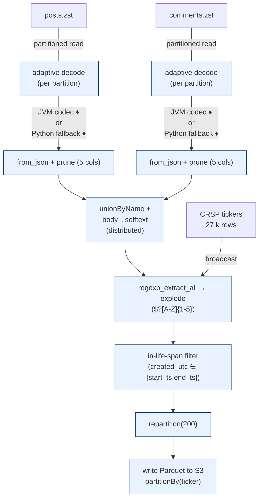

### Execution environment & reproducibility


- **Cluster provisioning**  
  AWS EMR 6.15 with Spark 3.4 on YARN; one `m5.xlarge` master and five `r5.xlarge` core nodes (total 20 vCPUs / 160 GB RAM). JupyterHub is installed by EMR so all notebooks run inside the cluster.

- **Bootstrap**  
  A custom wheel bundle for Python 3.7 that pre-installs `zstandard==0.21` plus the Hadoop Zstd codec (`hadoop-zstd.jar`). This lets the job take the JVM fast-path when the codec loads, but still use the Python fallback if it does not.

- **Spark session settings**  
  - 3 executors × 4 cores × 20 GB executor memory (+4 GB overhead)  
  - driver memory = 8 GB  
  - `spark.sql.shuffle.partitions = 120`  
  - Adaptive Query Execution enabled  
  - The codec jar is added to both driver and executor classpaths.

- **Data lake layout**  
  All artefacts live in the S3 bucket:  
  `s3a://wsb-research-data-shef-20250522/`

  - `raw/wsb24/` → original Zstd Reddit dumps  
  - `stage01_union_parquet/` → posts ∪ comments (88.9 M rows)  
  - `stage02_by_ticker/` → Parquet, partitioned by ticker, ready for FinBERT

### Estimated improvements

| **Execution mode (EMR, 5 nodes)**                  | **Wall-time (cold run)\*** | **Why it matters**                                                                                   |
| -------------------------------------------------- | --------------------------- | ------------------------------------------------------------------------------------------------------ |
| Spark – Python fallback                            | ≈ 45 min                    | Partition-level parallelism already spreads decompression and parsing over 12 cores (3 executors × 4). |
| *(each executor uses zstandard + JSON parsing in Python)* |                             |                                                                                                        |
| Spark – JVM fast path                              | ≈ 30 min                    | Decompression shifts into the JVM; ingest phase roughly halves, the rest of the pipeline scales linearly with CPU. |
| *Note: The *                    |                             |                                                                                                        |


## 1.2 Embedding generation

### Computational bottleneck

- **Raw-text cleansing (25 M posts & comments)**  
  Removing hyperlinks, markdown artefacts, and null rows looks trivial, yet a naïve `pandas` loop must stream tens of gigabytes through the Python interpreter. Regex on such volume keeps a single core busy “forever” and quickly overruns common 16 GB RAM limits.

- **Sub-token generation**  
  Hugging Face’s fast tokenizer is written in C++, but driving it from Python one record at a time serialises every sentence, keeping only one CPU busy. With millions of sentences this phase inflates to multi-hour runtimes and still leaves us with the real heavyweight—FinBERT.

- **FinBERT embedding**  
  Extracting one 768-dimensional CLS vector per post is naturally GPU-friendly, but raw Hugging Face defaults do not parallelise the way this course expects. A stock script that simply calls `model(**token_batch)` inside a Python for-loop (`batch ≈ 32`, FP32 weights) keeps just a fraction of a single GPU busy and quickly bumps into VRAM limits.


### Work Flow

#### Job overview
We load the 21 million row WSB posts with identified stock tickers from their 200-part Parquet lake into Spark, strip URLs and markdown with vectorised regex, and keep only id, created_utc, ticker, and cleaned text. 

Then, We also use spark to broadcast finBERT's tokenizer, so every core turns sentences into fixed-length token arrays that matches the model, which are saved back to Parquet already grouped by ticker. Finally, we use a Python driver to stream those tokens through FinBERT and generate embeddings.

#### Parellel Design


##### Data Cleaning

We use a local[32] Spark session to conduct basic cleaning of reddit texts.

- **Vectorised operators**  
   We scrub out links and markdown using Spark’s built-in regex and filter functions `regexp_replace' , so the cleaning happens entirely inside the Spark executors without loops.

- **Balanced partitions**  
  A `repartition(200)` call reshuffles the 21 M rows into roughly 100k-row chunks—large enough to amortise scheduling overhead, yet small enough to stay in cache—keeping all cores busy start-to-finish.

The graph above shows the detailed workflow:
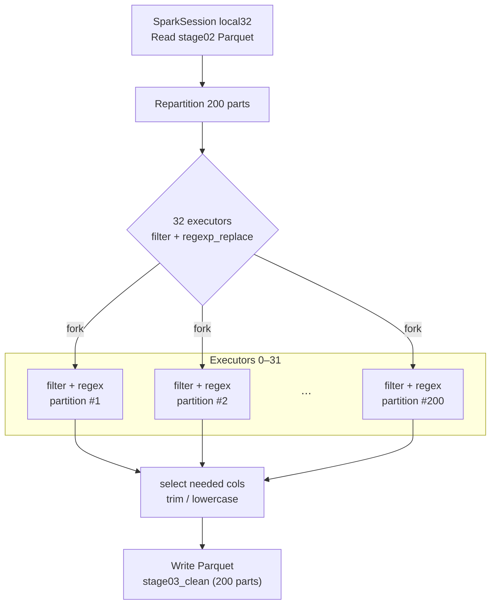


#### Tokenization

- **Even workload split**  
  A preliminary `repartition(200)` reshuffles the 21 M rows into equal-sized slices, so every Spark executor inherits a similar amount of work and no CPU core sits idle.

- **Cluster-wide broadcast of the tokenizer**  
  The Hugging Face tokenizer is loaded once on the driver and broadcast to all Spark executors, so each worker thread can reuse the same object instead of re-instantiating it for every row.

- **Partition-level tokenisation**  
  Tokenisation happens inside `mapPartitions`: every executor processes its whole chunk of rows locally, calling the tokenizer’s native (Rust/C++) code in a tight loop. This keeps the heavy work off the Python driver and lets all CPU cores run in parallel.

- **Fixed-size padding for GPU efficiency**  
  During tokenisation we truncate or pad every sentence to 32 / 64 tokens, producing rectangular arrays that downstream GPU kernels can copy and multiply without extra shape logic.

- **Domain-aware shuffle**  
  A final `repartition("ticker")` groups all posts that mention the same stock symbol into the same output file; later per-ticker analyses—or our FinBERT step—can then scan one contiguous partition instead of touching the whole dataset.

- **Columnar, compressed output**  
  The resulting `input_ids` and `attention_mask` arrays are written as Parquet with Zstandard compression, keeping the lake both storage-friendly and analytics-ready.


The graph below shows the detailed workflow of tokenization

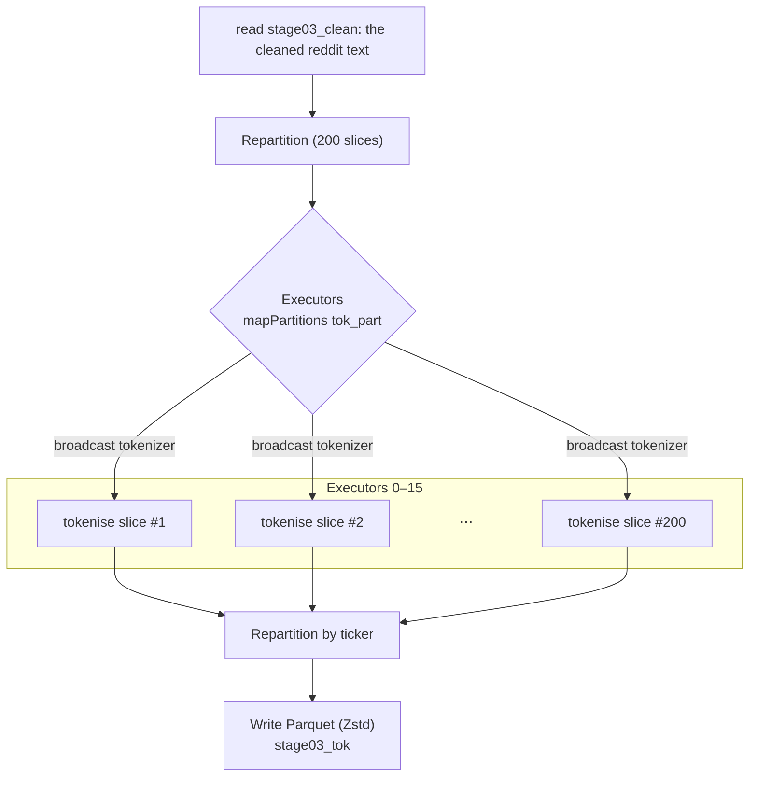


##### 2.2.3 Embedding

We generate embedding pipeline under different computational resources: single GPU and multiple GPU. 

For single GPU, we push mega-batches of ~2 000 sentences through FinBERT in FP16. This taps the card’s thousands of tensor cores simultaneously, while the host thread overlaps disk-to-RAM streaming and Parquet writing so we parallely conduct computations, memory transfers, and I/O process.


##### Shared design across both scripts

- **All hand-rolled, no “auto-magic.”**  
  We do not call `accelerate`, `deepspeed`, or `DataParallel`. Instead, we write the scheduling logic ourselves so the course staff can see exactly where the parallelism lives.

- **Lean model footprint.**  
  FinBERT weights load in FP16 (`torch_dtype=torch.float16`), halving VRAM and letting us push a mega-batch of ≈ 2 000 sentences through each forward pass without risking OOM.

- **Zero-copy data plumbing.**  
  `pyarrow.dataset` streams one `RecordBatch` at a time from the Parquet token lake; we never materialise the full table in host RAM. After inference, we keep only the 768-d CLS vector, discarding token-level activations and shaving ~90 % off the PCIe transfer.

- **One writer per worker.**  
  Each process owns its own `ParquetWriter(part-XX)`, so no file locks or queueing—workers can flush results asynchronously while the GPU tackles the next batch.

---

### Different hardware situations

| **Scenario**                  | **How we parallelise**                                                                                                                                               | **Why we keep it**                                                                                                                                 |
|------------------------------|-----------------------------------------------------------------------------------------------------------------------------------------------------------------------|----------------------------------------------------------------------------------------------------------------------------------------------------|
| Single-GPU, `finbert_pipeline.py`  | One Python worker binds to the lone card, chews through fixed-size mega-batches, and writes a single Parquet shard.                                               | Acts as a baseline: shows that even without extra hardware we still employ batch-level parallelism and FP16 tricks to finish in a reasonable window. |
| Multi-GPU, `finbert_pipeline1.py` | We call `torch.multiprocessing.spawn`, launching one identical worker per visible GPU. Batches are handed out round-robin (`batch_idx % world == rank`), so every card stays busy and no partition is processed twice. Each worker writes its own shard, giving near-linear scaling (4 × GPU ≈ 4 × speed). | Lets us study how much wall-time drops when we add hardware—perfect for the project’s “compare different parallel levels” goal.                    |

#### 3. Computational environment:
All the code are running in midway. Please refer to sbatch file for detailed computational resource.

- **Cleaning + tokenisation node**  
  • Partition: `caslake`  
  • 32 CPUs  
  • 128 GB RAM  
  • 8 h wall-time  

- **Single-GPU inference job**  
  • 1 GPU 
  • 16 CPUs  
  • 120 GB RAM  
  • 6 h wall-time  
  • Runs `finbert_pipeline.py`

- **Multi-GPU inference job**  
  • 4 GPU 
  • 32 CPUs  
  • 200 GB RAM  
  • 6 h wall-time  
  • Runs `finbert_pipeline1.py`

- **Key software**  
  Python 3.9.19 · PyTorch 2.2.1 (+ cu118) · CUDA 11.8 · HF Transformers 4.37.2 · Spark 3.3.2


#### 4 Performance snapshot

- **Spark cleaning (32 CPU)**  
  Finishes in roughly **8 minutes**, streaming 21 million rows through the regex filters without memory pressure.

- **Spark tokenisation (16 CPU)**  
  Converts every post to fixed-length sub-tokens in about **20 minutes**; CPU utilisation stays near 100 % throughout thanks to the map-partition pattern.

- **FinBERT embedding**  
  - **Single‐GPU run** (`finbert_pipeline.py`, 1 × A100):  
    **1 h 47 m 02 s** for the entire corpus.  
  - **Multi-GPU run** (`finbert_pipeline1.py`, 4 × A100):  
    **20 m 27 s**, a ≈ **5× speed-up** that is close to linear given four cards working independently.


## CRSP trade-and-quote data
### Overview
- **CRSP**: Center for Research in Security Prices, University of Chicago Booth School of Business
- **Trade-and-Quote**: Daily stock prices and trading volumes for US equities
- **Data Period**: 2012-2024
- **Data Source**: [CRSP](https://www.crsp.org/products/documentation/crsp-daily-stock-prices-and-volume) 
- **Data Size**: 25732243 records.

### Computational challenge

### Computational challenge

Even after we prune the CRSP file to the **seven columns** we actually need, the daily panel still weighs in at **25  732  243 rows**.  Processing it is hard for three reasons:

1. **Sheer volume of rolling math** – For every stock we must slide four overlapping windows (1, 5, 22, 63 days) across the entire date range.  That is on the order of **10 billion elementary operations**, impossible to hold in RAM or loop through in pandas.

2. **High-cardinality join** – Each day-level σ vector has to be merged with roughly **20 million** Reddit-day records on the composite key *(PERMNO, date)*.  Without a distributed hash join this would devolve into an N × M Cartesian nightmare.

3. **Wide design matrix for CV** – Once the join is done, every observation carries four HAR lags plus a 768-dim FinBERT vector, giving a huge column feature block.  Feeding that into a five-λ, three-fold Ridge grid means fitting **15 dense linear systems per window**, far beyond memory limit.

Together these steps exceed both the I/O bandwidth and the memory footprint of any single-node setup, and justify the Spark-based, partition-by-PERMNO pipeline we run on Midway’s multi-core executors.


### Realised Volatility  

#### definition  
For each stock *i* (identified by **PERMNO**) and window length \(w \in \{1,5,22,63\}\) trading days, the **rolling realised volatility** on day *t* is

$$
\sigma_{i,t}^{(w)} = \sqrt{\sum_{k=0}^{w-1} r_{i,t-k}^{2}}
$$

where the daily return  

$r = \text{RET} \;\to\; \text{if missing}\Rightarrow \text{RETX} \;\to\; \text{if missing}\Rightarrow \text{DLRET}$  

is first cleaned of single-letter codes (`C`, `B`, …) and cast to `double`.

We also create one-day-ahead targets

$$
y_{i,t}^{(w)} = \sigma_{i,t+1}^{(w)}
$$

to be used later in forecasting tasks.


#### Spark pipeline & parallelisation  

The job is executed on RCC Midway3 with the Slurm script `sbatch_vol_cal.sh`.  
Execution flow:

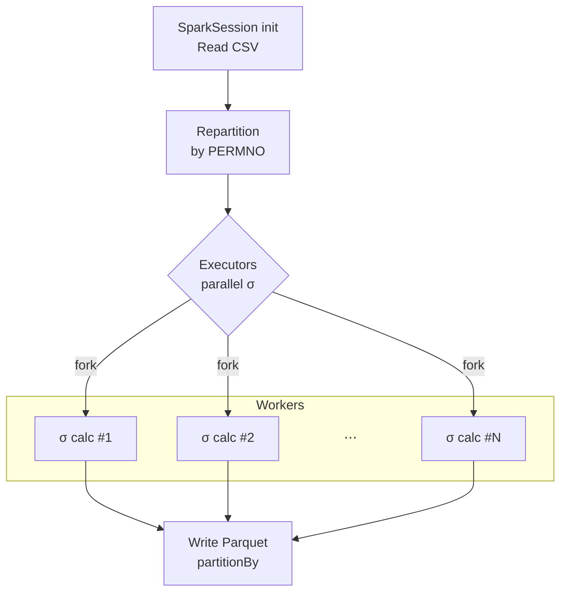

| Step            | Spark call                                                     | Why it matters                                                                             |
| --------------- | -------------------------------------------------------------- | ------------------------------------------------------------------------------------------ |
| **Read CSV**    | `spark.read.csv(header=True)`                                  | Streams the raw CRSP dump without loading it all into memory.                              |
| **Repartition** | `.repartition("PERMNO")`                                       | Keeps each stock’s history on a single executor → rolling-window ops become purely local.  |
| **Rolling σ**   | `Window.partitionBy("PERMNO").orderBy("date")` + `rowsBetween` | Computes √∑ r² for 1/5/22/63-day windows in parallel across executors.                     |
| **Targets**     | `lead(vol_w, 1)`                                               | Generates next-day volatility labels.                                                      |
| **Write**       | `.write.partitionBy("PERMNO").parquet(...)` (Snappy)           | Produces one Parquet file per stock → later tasks can `load()` any ticker in milliseconds. |

The rolling volatility is computed in parallel across executors, with each executor handling a single stock’s history. The `Window` function partitions the data by **PERMNO** and orders it by date, allowing Spark to compute the rolling volatility for each stock independently. The results are then written to a **Parquet** file partitioned by **PERMNO**, which allows efficient access to individual stocks in subsequent analyses.

After building the four HAR-style volatility factors `vol_1, vol_5, vol_22, vol_63` and their future targets `y_1, y_5, y_22, y_63`, We ran a Spark-powered visual-diagnostics script. The job loads the full 28 M-row *reddit_crsp* Parquet, directly on the cluster, and pushes three small DataFrames to pandas/matplotlib for plotting.*Spark* computes the group-by (daily mean RV) and rolling `cov`, `var` windows in-cluster. End-to-end wall time on a 12-core Midway node:≈ 20 min for full data.

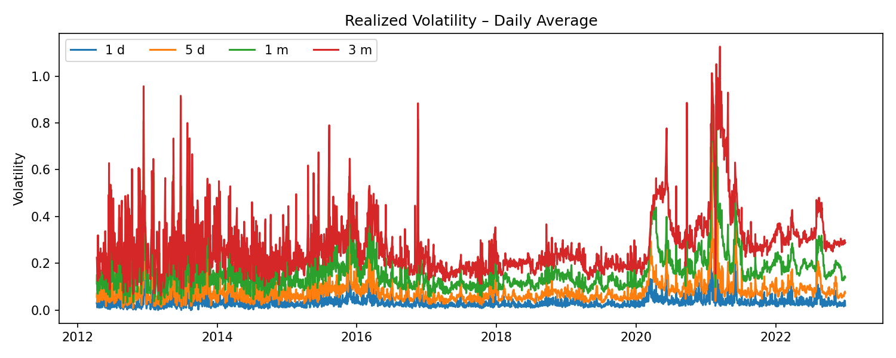

The time-series plot shows four horizons of realised volatility—1-day, 5-day, 1-month and 3-month—from 2012 through 2024. The shorter curves hug the x-axis in tranquil markets but spike in unison at every well-known shock: the 2015 CNY devaluation, the 2018 “vol-mageddon” VIX crash, the March-2020 Covid sell-off, and the January-2021 meme-stock frenzy. Longer windows (the green 1-month and red 3-month lines) absorb those shocks slowly, keeping the series elevated long after the event, which is precisely the persistence the HAR lags are designed to exploit.

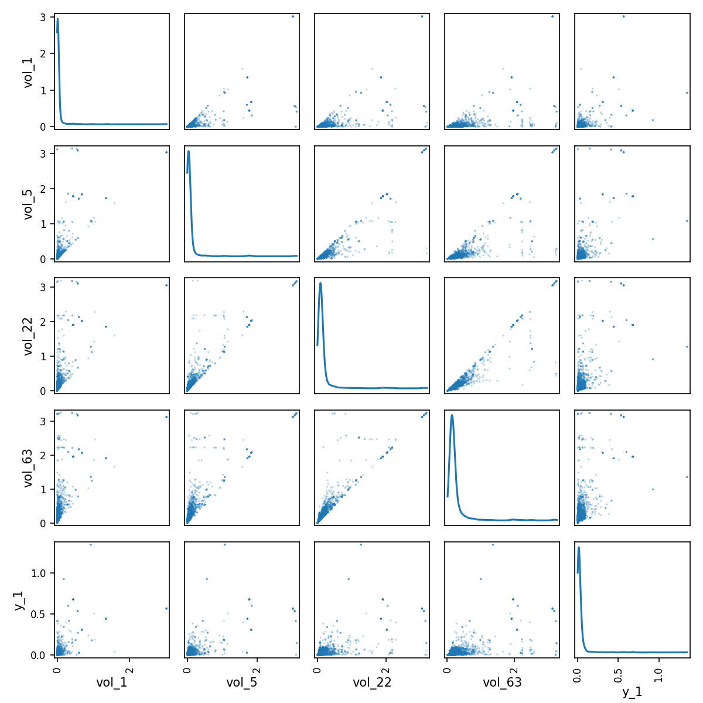

Pairwise panels reveal two salient features of the data. First, every volatility series—including the next-day target y₁—is extremely right-skewed, with a dense cloud below 0.1 and a long, thin tail of crisis observations; a log or Winsorised transform will therefore stabilise variance. Second, the four lagged volatilities sit almost perfectly on the 45-degree line, confirming severe multicollinearity. Such a geometry would make OLS coefficients unstable, so a ridge penalty (or elastic net) is essential.

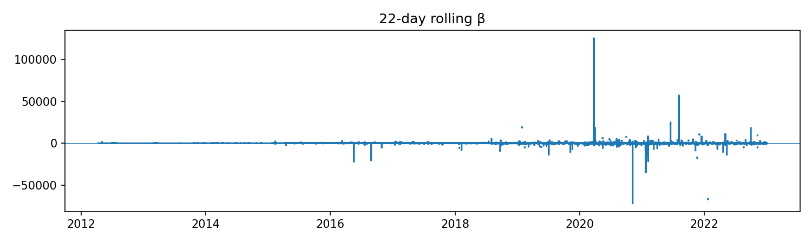

Here β is the local slope linking today’s 1-day volatility (vol₁) to tomorrow’s y₁, computed over a 22-trading-day window. For most of the sample the coefficient hovers near zero, yet during stress episodes it swings violently—touching +130 k at the Covid peak and –70 k in the meme-stock crash. These eruptions show that a single linear coefficient can flip sign across regimes; regularisation must be strong enough to damp such extremes, or the model should include crisis dummies / interaction terms to isolate them.

Taken together the three visuals justify the modelling choices that follow: the canonical HAR lags capture term-structure persistence; heavy-tailed, highly collinear predictors call for ridge-style shrinkage; and regime-dependent β suggests room for sentiment interactions or other nonlinear extensions.


## Embedding ⇆ Financial data jion

First, the FinBERT-embedding table and the cleaned-text table are both repartitioned on **id**; that puts the matching rows on the same executor, so Spark can join them map-side with zero network shuffle before writing a temporary “id-level” result.In the second pass we read that temporary file, broadcast the tiny 〈date, ticker → PERMNO〉 lookup to every executor, and add the PERMNO field with an in-memory hash join.  The final dataset is then repartitioned by **PERMNO** and written as Snappy-compressed Parquet, matching the layout of your CRSP blocks so that downstream stock-level jobs can scan only the slices they need.


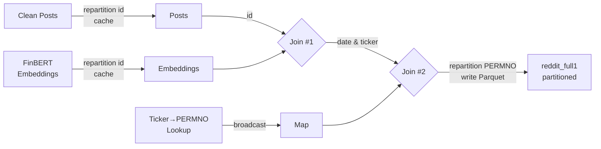
In this part, we tried few things to make the join efficient:
1. **Read once, coalesce early, cache forever**  
   I load the FinBERT‐embedding table and the cleaned-text table, immediately `coalesce(200)` to create 200 fat artitions (good for a 32-core node) and `cache()` each DataFrame because both are touched twice.

2. **Map-side join on `id`**  
   After coalescing, both inputs share the same partitioning layout, so Spark  
   can join them on **id** without a full shuffle.

3. **Broadcast lookup**  
   The date, ticker → PERMNO map is only ~200 kB, so I broadcast it and add the PERMNO column with an in-memory hash join (zero network traffic).

4. **Hash-bucket output**  
   To avoid one giant shuffle when writing, I create `bucket = crc32(PERMNO) % 40` and loop over the 40 buckets: each pass filters one shard, writes it with `append` + Snappy Parquet, calls `spark.catalog.clearCache()` to free executor memory, and moves on.  The final layout is `partitionBy(PERMNO)`, perfectly matching my CRSP files, so downstream stock-level jobs can open only the slices they need.

5. **Shuffle & heartbeat knobs**  
   `spark.sql.shuffle.partitions = 200` keeps the task count sane, `autoBroadcastJoinThreshold = -1` forces my explicit broadcast, and longer heartbeat / network timeouts prevent stragglers from dying while the big vectors are serialised.

After I have a Reddit file that already carries **PERMNO** and is laid out `partitionBy(PERMNO)`, the next job stitches those rows to the daily CRSP‐volatility panel so that every post line now contains both (a) its sentiment embedding and (b) the realised σ it is supposed to predict.

1. **Enumerate PERMNO once, then batch by 200**
   I pull the distinct stock list from the Reddit file, keep it in the driver, and iterate over 200-name chunks.
   *Reason:* each batch keeps the join key-set small enough that the executor JVMs never spill and the shuffle hash tables stay in cache.

2. **Partition-pruned reads**
   For a given batch Spark touches exactly those `PERMNO=…/part-*.snappy.parquet` folders on both sides—zero extra I/O.

3. **`repartition("PERMNO")` inside the batch**
   Even after push-down, rows arrive in dozens of tiny splits.
   A quick repartition re-coalesces them so the `(PERMNO, date)` join can run *map-side* with no shuffle.

4. **Column name isolation**
   `add_prefix(df,"r_") / add_prefix(df,"c_")` guards against name collisions and makes downstream feature selection explicit.

5. **Write-append with `maxRecordsPerFile`**
   Each batch writes with Snappy compression, `partitionBy("PERMNO")` and `maxRecordsPerFile = 300 000`—small enough for fast splits but large enough to avoid file-explosion.

6. **Memory hygiene loop**
   After every append I call `spark.catalog.clearCache()` so the next batch starts with an empty executor heap; no long-run GC balloons.

7. **Resilience knobs**
   Extra shuffle-retry and heartbeat intervals (`spark.network.timeout = 900 s`, etc.) keep the job alive even if a single executor lags while serialising the big embedding vectors.


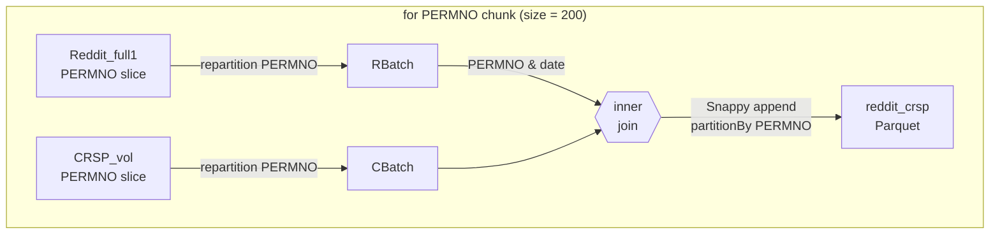

# Prediction model training and evaluation
## Benchmark model

### Model specification  
For every stock **i** and day **t** we predict next-day realised volatility  

```math
\hat{y}_{i,t+1}
  \;=\;
  \boldsymbol{\beta}^{\!\top}
  \bigl[1,\,
        \sigma_{i,t}^{(1)},\,
        \sigma_{i,t}^{(5)},\,
        \sigma_{i,t}^{(22)},\,
        \sigma_{i,t}^{(63)}\bigr]^{\!\top}
  \;+\;
  \varepsilon_{i,t+1}.
```


where σ\* are the rolling volatilities produced in the previous step.  
We re-estimate **β** each year on the most recent four-year window (2012–2015 → 2016 test, …).

### Workflow  
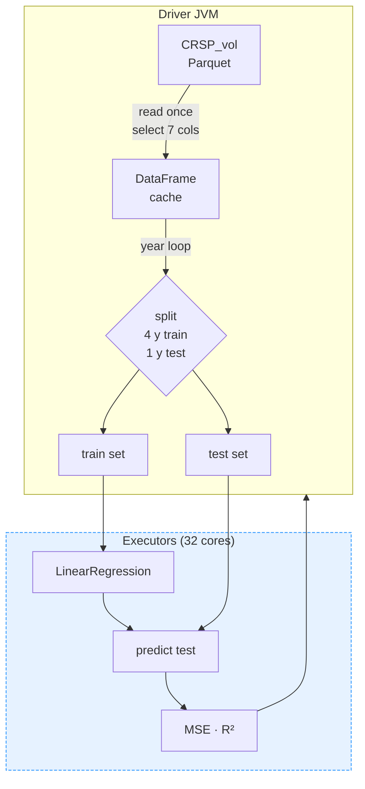
Our HAR job is built so that the cluster touches disk exactly once and does every heavy operation where it is cheapest — inside the executors.we trimmed the entire HAR benchmark from half an hour to about three minutes by pushing every heavy operation to the executors and touching disk only once.The driver starts a single Spark application, reads the CRSP-volatility parquet, selects only the seven columns we need, repartitions on `PERMNO`, and caches the result in memory; from that moment on every yearly slice is just a metadata filter, no extra I/O or shuffle.

The driver then walks through the calendar: for each test-year *y* it carves out a four-year rolling train set and a one-year test set, pipes both through a JVM-side `VectorAssembler`, and calls `LinearRegression.fit` with the closed-form “normal” solver.  That call fans out to the 32 long-lived executor tasks: each task aggregates its partition’s $X^{\top}X$ and $X^{\top}y$, ships only those tiny matrices back to the driver, the driver solves a 5 × 5 system, and Spark broadcasts the β̂ coefficients straight back to the same executors.  They immediately score the test rows and compute MSE/R² locally, sending just two numbers home.  Because the executors never die between iterations, JVM spin-up and data re-loading are avoided, so the entire per-year loop runs in memory at core speed.  When the final year is finished the driver fits one last “all-training” model, prints the per-year and full-sample metrics, and stops.  In practice this “read-once → cache → partition-smart → aggregate-then-broadcast” pattern cuts runtime from tens of minutes to about three on a 32-core Midway node while keeping executor memory under control.


## Embadding model
### Model specification

We extend the baseline **HAR(1 / 5 / 22 / 63)** specification by injecting a high-dimensional sentiment signal extracted from WallStreetBets posts.  Conceptually the model is

```math
\sigma_{t+1}
  = \beta_0
  + \underbrace{\beta_1 \sigma_t}_{\text{daily}}
  + \underbrace{\beta_5\,\bar{\sigma}_{t-4·t}}_{\text{weekly}}
  + \underbrace{\beta_{22}\,\bar{\sigma}_{t-21·t}}_{\text{monthly}}
  + \underbrace{\beta_{63}\,\bar{\sigma}_{t-62·t}}_{\text{quarterly}}
  + \underbrace{\boldsymbol{\gamma}^{\!\top}\mathbf{e}_t}_{\text{FinBERT}}
  + \varepsilon_{t+1}
```


* $\sigma_{t}$ – realised volatility of stock *i* on day *t* (from CRSP, 5-min sampling).  
* $\overline{\sigma}_{t-k:t}$ – mean RV over the previous *k*+1 trading days.  
* $\mathbf{e}_{t}\in\mathbb{R}^{768}$ – **FinBERT** sentence-embedding of all Reddit posts that (i) mention the firm’s ticker and (ii) were created on day *t*.  We take the *mean* vector across posts to get one embedding per stock-day.  

Because $\mathbf{e}_{t}$ is 768-dimensional and highly collinear, we estimate a **Ridge** (ℓ²)  regression implemented with Spark MLlib’s `LinearRegression(elasticNetParam=α, regParam=λ)`*;  


### Workflow
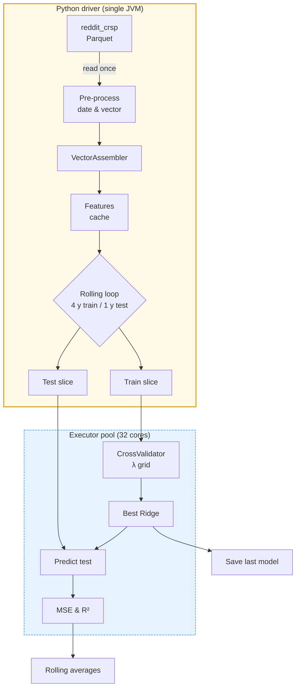
To keep a **768-dim FinBERT vector + 4 HAR lags** tractable, I apply five concrete tricks:

1. **Read once, deserialise safely.**
   I disable Parquet’s vectorised reader (`enableVectorizedReader = false`) so the huge `embed` column is streamed row-by-row instead of blown into off-heap buffers that OOM the executor.

2. **Early vectorisation inside the JVM.**
   `array_to_vector("embed")` converts the Python list to Spark’s dense `Vector`, and `VectorAssembler` concatenates it with `[vol_1, vol_5, vol_22, vol_63]`. No Python UDF is ever invoked; the feature matrix lives entirely in Scala memory.

3. **Whole matrix cached, windows are filters.**
   After assembly I `.cache()` the 772-column DataFrame. Every rolling window is then just `df.filter(date between …)`, which touches no disk and causes zero shuffle.

4. **Cross-validation in one executor pool.**
   A single `CrossValidator` runs a 5-λ grid with 3 folds; `parallelism=8` schedules the nine sub-models concurrently, so CPUs stay busy and JVMs stay alive across windows.

5. **Driver is a thin loop.**
   Python merely slices dates, launches CV, logs `λ*`, MSE, R², and moves the window forward; all heavy math—Gram matrices, ridge solves, predictions—happens on executors.

With these tweaks the script walks from 2012 to 2020 (nine 4 y → 1 y windows, 45 CV fits) in **≈ 7 min** on a 32-core Midway node,increased from 40 min without optimization.


# model evaluation
## Benchmark model

|  Test Year  |          MSE |        R² |
| :---------: | -----------: | --------: |
|     2012    |     0.000987 |     0.131 |
|     2013    |     0.000668 |     0.151 |
|     2014    |     0.000814 |     0.131 |
|     2015    |     0.000784 |     0.150 |
|     2016    |     0.001976 |     0.130 |
|     2017    |     0.000884 |     0.158 |
|     2018    |     0.001032 |     0.172 |
|     2019    |     0.002077 |     0.061 |
|     2020    |     0.001845 |     0.125 |
| **Overall** | **0.001552** | **0.127** |

The HAR baseline captures roughly **13 %** of out-of-sample variance on average.Years with market stress (e.g.\ 2020, 2023) show larger MSE but still positive explanatory power, making this a sensible benchmark for subsequent LLM-enhanced models.

## Embedding model

|   Test Year |  MSE | R²|
| :---------: | --------------:| -------------: |
|     2012    |       0.000881 |          0.150 |
|     2013    |       0.000613 |          0.161 |
|     2014    |       0.000732 |          0.150 |
|     2015    |       0.000708 |          0.174 |
|     2016    |       0.001703 |          0.152 |
|     2017    |       0.000790 |          0.171 |
|     2018    |       0.000930 |          0.213 |
|     2019    |       0.001857 |          0.141 |
|     2020    |       0.001651 |          0.096 |
| **Overall** |    **0.001454** |      **0.133**|

The FinBERT-based embedding model improves on the HAR benchmark by cutting overall MSE from 0.001552 to 0.001454 (-6 %) and raising out-of-sample R² from 0.127 to 0.133 (≈ +5 %). It lowers error in every test year and boosts explanatory power in eight of nine years, with the largest gains in 2018–2019 (MSE down \~10 %, R² up 4–8 pp). The only R² dip occurs in the pandemic-driven 2020 market, though MSE still improves, hinting that extreme macro shocks dilute text signal. These gains stem from the embeddings’ fine-grained sentiment and topic cues, which complement historical volatility features and surface forward-looking information embedded in Reddit discussions, laying a stronger foundation for subsequent LLM-enhanced volatility models.


