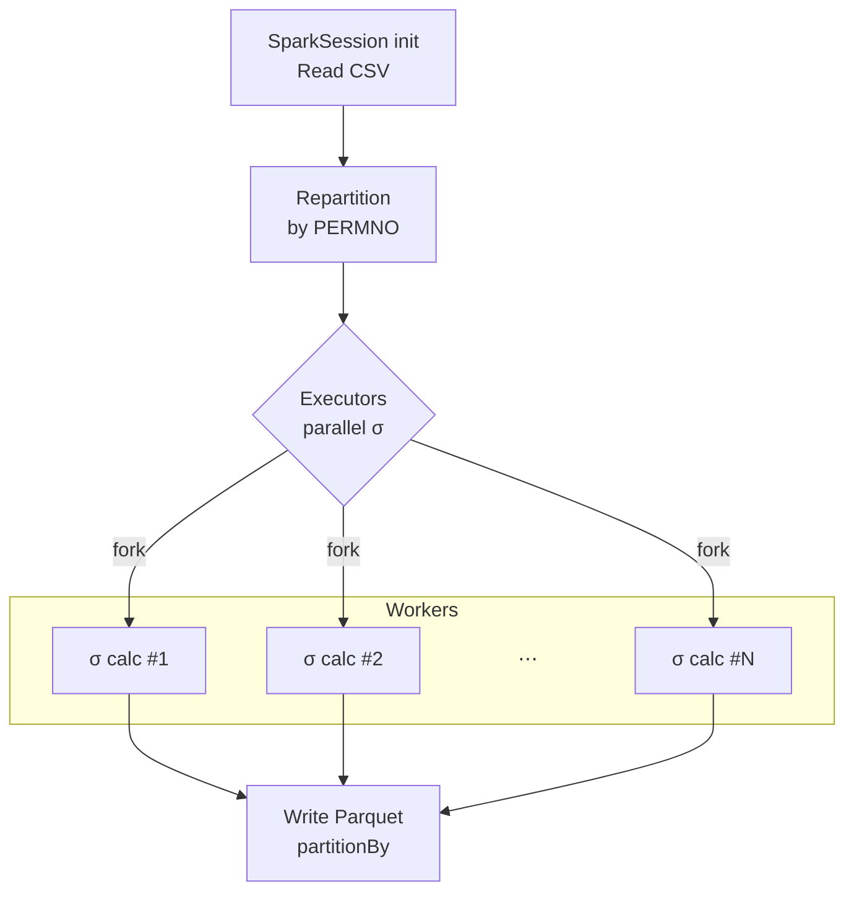
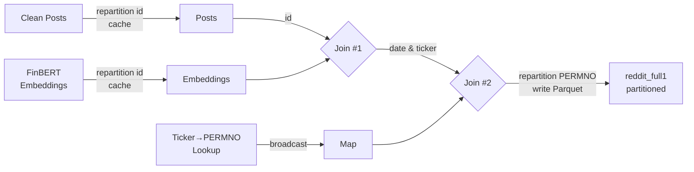
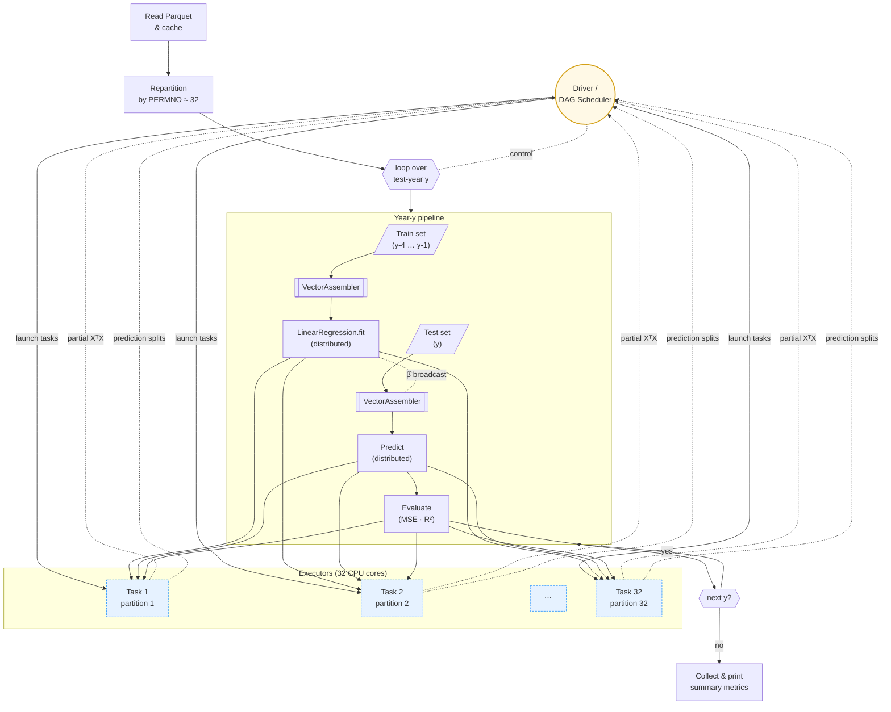

# High-Performance FinBERT pipelines mining r/WallStreeBet for volatility signals

This is the final project for **MACS 30123 — Large-Scale Computing for the Social Sciences**, carried out by **Zhiyu Zheng** and **Zherui Lu**. In this work we implement large-scale computing—Spark, distributed GPUs, and AWS Batch on RCC—to mine and clean **\~20 million WallStreetBets Reddit posts (2012-2024)**, embed each post with **FinBERT**, and join the resulting 768-dimensional vectors with CRSP trade-and-quote data. We then train elastic-net and LSTM models in parallel to forecast daily realized volatility for US stock, evaluating performance with MSE, $R^{2}$. The project demonstrates how scalable NLP pipelines can transform retail-investor sentiment into actionable sigma-risk signals, fulfilling the course’s mandate to combine high-performance computing with social-science insight.

# README Navigation

# Responsibilities

- Zherui Lu: 
  - Reddit post data collection and cleaning
  - FinBERT embedding creation
- Zhiyu Zheng:
  - Financial data collection and cleaning
  - Predictioin model training and evaluation

## 2 Research Questions
1. **Collective Retail Voice → Volatility**  
   Can sentiment embeddings extracted from Reddit’s r/WallStreetBets improve the prediction of stock volatility?

2. **Value-Added of Embeddings**  
   What part of the sentiment embeddings learned that is most predictive of volatility? 

# Social Science Significance

* **Beyond the Rationality Assumption**

  * Traditional asset-pricing models treat investors as fully rational, yet emotions and narratives often drive real-world trades.
  * Online forums amplify herd behaviour and speculation.

* **Shedding Light on the Social-Media Effect**

  * Platforms such as *Reddit* accelerate information diffusion and reinforce emerging market trends.
  * Mapping sentiment dynamics advances research on digital communities and mass behaviour.

* **Practical Implications**

  * Integrating sentiment analytics into risk-management dashboards offers a new lens for real-time market monitoring.
  * Alternative data improve volatility forecasting beyond conventional signals.

# Date

## Reddit r/WSB post dats

## CRSP trade-and-quote data
### Overview
- **CRSP**: Center for Research in Security Prices, University of Chicago Booth School of Business
- **Trade-and-Quote**: Daily stock prices and trading volumes for US equities
- **Data Period**: 2012-2024
- **Data Source**: [CRSP](https://www.crsp.org/products/documentation/crsp-daily-stock-prices-and-volume) 
- **Data Size**: 25732243 records.

### Rolling Realised Volatility  

#### Volatility definition  
For each stock *i* (identified by **PERMNO**) and window length \(w \in \{1,5,22,63\}\) trading days, the **rolling realised volatility** on day *t* is

$$
\sigma_{i,t}^{(w)} = \sqrt{\sum_{k=0}^{w-1} r_{i,t-k}^{2}}
$$

where the daily return  

$r = \text{RET} \;\to\; \text{if missing}\Rightarrow \text{RETX} \;\to\; \text{if missing}\Rightarrow \text{DLRET}$  

is first cleaned of single-letter codes (`C`, `B`, …) and cast to `double`.

We also create one-day-ahead targets

$$
y_{i,t}^{(w)} = \sigma_{i,t+1}^{(w)}
$$

to be used later in forecasting tasks.

#### Spark pipeline & parallelisation  

The job is executed on RCC Midway3 with the Slurm script `sbatch_vol_cal.sh`.  
Execution flow:

| Step            | Spark call                                                     | Why it matters                                                                             |
| --------------- | -------------------------------------------------------------- | ------------------------------------------------------------------------------------------ |
| **Read CSV**    | `spark.read.csv(header=True)`                                  | Streams the raw CRSP dump without loading it all into memory.                              |
| **Repartition** | `.repartition("PERMNO")`                                       | Keeps each stock’s history on a single executor → rolling-window ops become purely local.  |
| **Rolling σ**   | `Window.partitionBy("PERMNO").orderBy("date")` + `rowsBetween` | Computes √∑ r² for 1/5/22/63-day windows in parallel across executors.                     |
| **Targets**     | `lead(vol_w, 1)`                                               | Generates next-day volatility labels.                                                      |
| **Write**       | `.write.partitionBy("PERMNO").parquet(...)` (Snappy)           | Produces one Parquet file per stock → later tasks can `load()` any ticker in milliseconds. |

With `--master local[$SLURM_CPUS_PER_TASK]` the driver launches a multi-threaded Spark instance that uses all 32 CPU cores requested from Slurm (`--cpus-per-task=32`).
Driver memory is capped at **60 GB** (`--driver-memory 60g`), leaving 4 GB for the OS/Python overhead.

The rolling volatility results are written to a **Parquet** file partitioned by **PERMNO** (stock identifier), which matches the layout of the CRSP blocks. This allows downstream jobs to scan only the slices they need, significantly speeding up data access.

#### Embedding ⇆ Financial data Join 

First, the FinBERT-embedding table and the cleaned-text table are both repartitioned on **id**; that puts the matching rows on the same executor, so Spark can join them map-side with zero network shuffle before writing a temporary “id-level” result.In the second pass we read that temporary file, broadcast the tiny 〈date, ticker → PERMNO〉 lookup to every executor, and add the PERMNO field with an in-memory hash join.  The final dataset is then repartitioned by **PERMNO** and written as Snappy-compressed Parquet, matching the layout of your CRSP blocks so that downstream stock-level jobs can scan only the slices they need.

# prediction model training and evaluation
## Benchmark model

### Model specification  
For every stock **i** and day **t** we predict next-day realised volatility  

\[
\hat{y}_{i,t+1}
  \;=\;
  \boldsymbol{\beta}^{\!\top}
  \bigl[1,\,
        \sigma_{i,t}^{(1)},\,
        \sigma_{i,t}^{(5)},\,
        \sigma_{i,t}^{(22)},\,
        \sigma_{i,t}^{(63)}\bigr]^{\!\top}
  \;+\;
  \varepsilon_{i,t+1}.
\]

where σ\* are the rolling volatilities produced in the previous step.  
We re-estimate **β** each year on the most recent four-year window (2012–2015 → 2016 test, …).

### Workflow  

every `fit`/`transform` call fans out to Spark executors, while the source Parquet is cached in memory once.

### Benchmark model Results

|  Test Year  |          MSE |        R² |
| :---------: | -----------: | --------: |
|     2016    |     0.000987 |     0.131 |
|     2017    |     0.000668 |     0.151 |
|     2018    |     0.000814 |     0.131 |
|     2019    |     0.000784 |     0.150 |
|     2020    |     0.001976 |     0.130 |
|     2021    |     0.000884 |     0.158 |
|     2022    |     0.001032 |     0.172 |
|     2023    |     0.002077 |     0.061 |
|     2024    |     0.001845 |     0.125 |
| **Overall** | **0.001552** | **0.127** |

The HAR baseline captures roughly **13 %** of out-of-sample variance on average.Years with market stress (e.g.\ 2020, 2023) show larger MSE but still positive explanatory power, making this a sensible benchmark for subsequent LLM-enhanced models.

